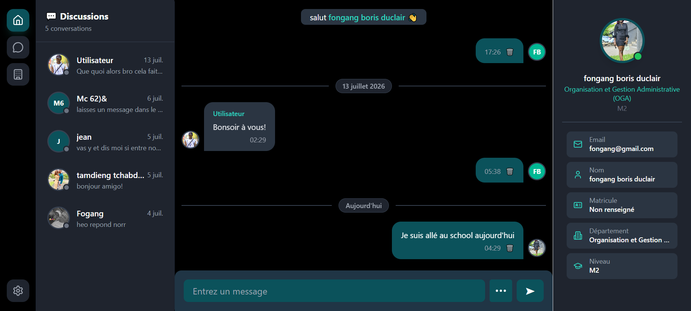
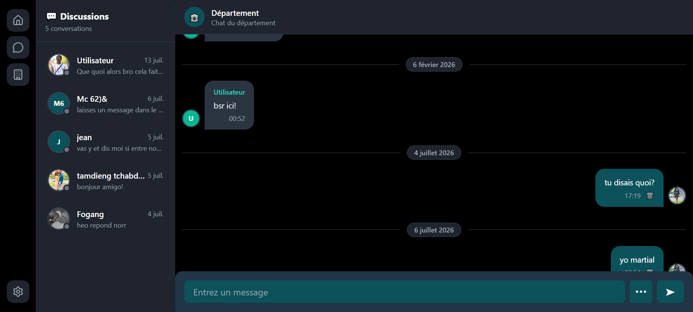
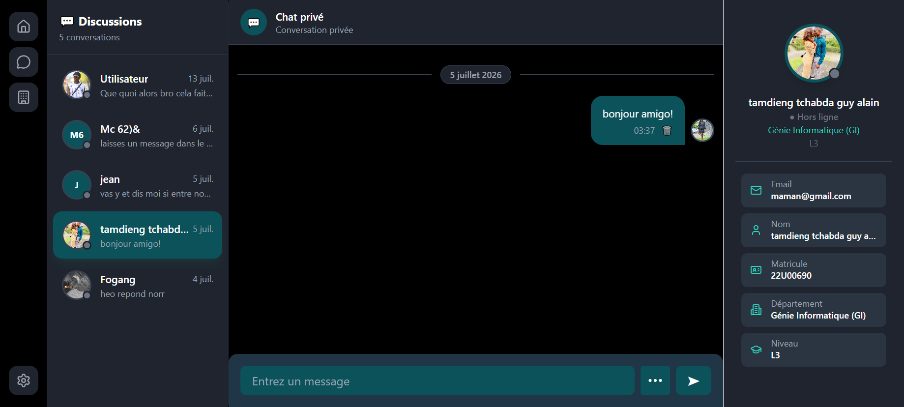

# Link Web 💬

> Application web de messagerie en temps réel pour étudiants de l'**ENSPD — Université de Douala** 🇨🇲


---

## 🚀 Accès à l'application

👉 **[link-enspd.netlify.app](https://link-enspd.netlify.app)**

---

## 📸 Aperçu

### Chat Global


### Chat Département


### Chat Privé


---

## ✨ Fonctionnalités

- 💬 **Chat global** — espace de discussion ouvert à tous les étudiants
- 🏛️ **Chat par département** — discussions réservées à chaque département
- 🔒 **Chat privé** — conversations en tête-à-tête entre étudiants
- 👤 **Profil utilisateur** — photo, nom, matricule, département, niveau
- 🟢 **Statut en ligne** — indicateur temps réel de présence
- 📷 **Partage multimédia** — images, vidéos et fichiers via Cloudinary
- 📅 **Séparateur de date** — Aujourd'hui, Hier, date complète
- ⭐ **Favoris** — sauvegarde des messages importants
- ✏️ **Modifier/Supprimer** — gestion de ses propres messages
- 🔐 **Authentification** — inscription et connexion sécurisées
- 📱 **Responsive** — adapté mobile et desktop

---

## 📱 Version Mobile

Une version mobile React Native est également disponible :

👉 **[Télécharger l'APK Android](https://expo.dev/accounts/gattdaniel/projects/Link/builds/673318f2-b325-4334-abe2-439321087b0a)**

[](https://github.com/gattdaniel/Link-mobile)

---

## 🛠️ Technologies

| Technologie | Rôle |
|---|---|
| React JS 18 | Interface utilisateur |
| Firebase Auth | Authentification |
| Firebase Firestore | Base de données temps réel |
| Tailwind CSS | Style et mise en page |
| React Router DOM | Navigation SPA |
| Cloudinary | Hébergement médias |
| Vite | Outil de build |
| Netlify | Hébergement |

---

## ⚙️ Installation locale

### Prérequis
- Node.js v18+
- Compte Firebase
- Compte Cloudinary

```bash
# 1. Cloner le projet
git clone https://github.com/gattdaniel/link.git
cd link1

# 2. Installer les dépendances
npm install

# 3. Configurer Firebase dans src/services/Firebase.js

# 4. Lancer l'application
npm run dev

# 5. Ouvrir dans le navigateur
# http://localhost:5173
```

---

## 🔥 Configuration Firebase

Dans `src/services/Firebase.js` :

```javascript
const firebaseConfig = {
  apiKey: "VOTRE_API_KEY",
  authDomain: "votre-projet.firebaseapp.com",
  projectId: "votre-projet",
  storageBucket: "votre-projet.appspot.com",
  messagingSenderId: "VOTRE_ID",
  appId: "VOTRE_APP_ID"
};
```

---

## 📁 Structure du projet

```
link1/
├── src/
│   ├── services/
│   │   └── Firebase.js        ← Configuration Firebase
│   ├── context/
│   │   └── context.jsx        ← Authentification globale
│   ├── components/
│   │   ├── Choice.jsx         ← Sidebar navigation
│   │   ├── InboxList.jsx      ← Liste conversations
│   │   ├── DepartementList.jsx← Liste départements
│   │   ├── Profil.jsx         ← Profil utilisateur
│   │   ├── UserInfo.jsx       ← Infos contact
│   │   └── Handlesend.jsx     ← Envoi messages & médias
│   └── pages/
│       ├── login.jsx          ← Page connexion
│       ├── signup.jsx         ← Page inscription
│       ├── romm.jsx           ← Chat global
│       ├── PrivateChat.jsx    ← Chat privé
│       └── Privatedepartment.jsx ← Chat département
├── public/
│   └── logo_link_round.svg
├── netlify.toml
├── vite.config.js
└── package.json
```

---

## 👨‍💻 Auteur

**TAMDIENG TCHABDA GUY ALAIN**
Matricule : 22I00690
ENSPD — Université de Douala
Master 1 Génie Logiciel — 2025/2026

[](https://github.com/gattdaniel)

---

## 📄 Licence

Projet académique — ENSPD Douala 2025–2026
